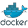

# Hi there 👋

## `Hello World!!!` My name is `Luis Caldas`
### `💻Senior Software Engineer` | `🚀Troubleshooter` | `♻️Focused on being better today than I was yesterday`

## 📫 How to contact me:
### [luisnt.eu@gmail.com](mailto:luisnt.eu@gmail.com)  |  [+55 98 9 8111 2233](tel://+5598981112233)  |  [WhatsApp](https://wa.me/+5598981112233)  |  [Telegram](https://t.me/luisnt)  |  [LinkedIn](https://www.linkedin.com/in/luisnt) 

## 😁 About me:
- 🔭 I currently work with systems integration with Delphi/Alexandria, Node.js, React, PHP, Laravel and the main commercial databases, studying new technologies to improve my skills in architecture, analysis, development and software testing.
- 👯 I am looking to collaborate on: Open source projects that involve the technologies I master and that challenge me to learn more every day.
- 🤔 I am looking for help with: Complex challenges in systems architecture and integration of new technologies.
- 💬 Ask me about:
  - Custom software development, Desktop, Web and Mobile with Delphi, Node/Express/Adonis.js, Next.js/React, Android Studio, PWA...
  - Integration of complex architectures, distributed applications and databases
  - Optimization of media resources and binary compression
  - Creation of REST APIs with Delphi, Laravel, Node.js
  - Automation of tasks with Cypress, Robot and Selenium

## 🤖 Skills and Technologies

* **Languages:** Delphi/IDL/Pascal, PHP, JavaScript/EcmaScript/ES6, TypeScript, HTML, CSS, SQL, Pl/Sql, C#, Java, ...
* **Frameworks/Libraries:** React, Next.js, AdonisJs, Express, Laravel, AdonisJs, Express, NextJs,
* **Databases:** MySQL/MariaDB, PostgreSQL, SQL Server, Sybase/Sql Anyware, Firebird, Interbase, SQLite, Oracle, MongoDB
* **Tools:** Node.js, REST, Git, GitHub, WebService, WebSocket, VMWare, Virtualization, Delphi, Cypress, Swagger
* **Others:** Api, WebService, WebSocket

## 💻 Featured Public Projects

* [**Deploy program project:**](https://github.com/luis-portfolio/Deploy) Project in Delphi/Alexandria for media resource optimization and 32/64-bit binary compression
* [**Node JS API:**](https://github.com/luis-portfolio/Node.JS-Server-with-Express) APIs for frontend development (web, desktop and mobile)
* [**Node JS API (JSON without restrictions):**](https://github.com/luis-portfolio/Api-Node.JS-with-express-to-proxy-url) API to obtain JSON data without access restrictions
* [**Autofill-Europass-with-Cypress:**](https://github.com/luis-portfolio/Autofill-Europass-with-Cypress) Automation of Europass filling with Cypress
* [**Backend for uploading images:**](https://github.com/luis-portfolio/backdev) Development backend with support for image uploads
* [**Chronometer:**](https://github.com/luis-portfolio/Chronometer) Built with Vanilla JavaScript, HTML5 and CSS3
* [**REST API with C# & Swagger:**](https://github.com/luis-portfolio/Api-REST-C-Sharp) REST API in C# with Swagger documentation

## 💼 Professional Experience

* **Senior Software Engineer at Proinddy Business Automation (2007 – Current):** Consulting, architecture, analysis, development and software testing
* **Software Engineer at SET São Luis (2009 – 2023):** Management, support and software development
* **Professor at CEUMA University (2008 – 2009):** Teaching courses and workshops
* **Systems Analyst at Faculdade Atenas Maranhense (2005 – 2007):** Application development and server maintenance

## 🤓 Languages and Tools:

## 🎓Academic training, courses and events

* [Repo](https://drive.google.com/drive/folders/1dFcyyA1dNIoBrmbFs6IzWfiw6LLwBsmh?usp=drive_link)
- 2009 - 🥇 Higher Education Course in Systems Analysis and Development from CEUMA University with honors.
- 2014 - FLISOL 2014 Certificate
- 2019 - Google DevFest 2019 Certificate
- 2021 - Kubernets
- 2022 - Webinar Certificate - QA Trends and Applications
- 2022 - Lean Emotional WORKSHOP CERTIFICATE
- 2022 - Pocket IT Congress, Unified Communications
- 2022 - Jira and Concluence
- 2022 - Learning - Certificate - How to Influence People
- 2022 - Learning - Certificate - Building Trust
- 2022 - Learning - Certificate - Discover Microsoft Project
- 2022 - Learning - Certificate - Project Management Fundamentals, Change Requests
- 2022 - Learning - Certificate - Leading Change
- 2022 - Learning - Certificate - Interpersonal Communication Techniques
- 2022 - Transfer English - A1 - Transfer Experience - Operational English
- 2023 - Agile Scrum Master (ASM®) - SkillUP
- 2023 - Alternative Agile
- 2023 - ArduinoDay - Crescer Engeasier
- 2023 - React JS Challenges - Interviews and technical tests
- 2023 - Spanish - A2
- 2023 - DEV VINCIT Event
- 2023 - Special Edition Event 3rd HACKER SUMMIT 2023
- 2023 - Exploring the synergy between RPA and GPT Chat
- 2023 - Electronic Fraud, Crime and Investigation - VINCIT University
- 2023 - Task Management and Productivity with Microsoft Tools
- 2023 - LPIC-010-160 - Linux Essentials
- 2023 - Don't change the quality of processes. Change the quality of the culture involved in the processes
- 2023 - Personal Data Protection in Technology Development
- 2023 - QA Culture
- 2023 - Selenium Automation of Millions
- 2023 - Transfer English - B1 - International English - Think and Speak
- 2024 - Systems Administration and IT Infrastructure Services
- 2024 - Basic Aspects of Technical Assistance
- 2024 - BDD eXperience - Udemy
- 2024 - Java Developer Training
- 2024 - Laravel 11
- 2024 - The Bits and Bytes of Computer Networks
- 2024 - Computer Security Defends Against Digital Dark Arts
- 2024 - Operating Systems and Becoming an Advanced User
- 2024 - Google Information Technology Support
- 2024 - TypeScript - 20 hours - RL System Certificate
- 2025 - Advanced Delphi Techniques

## 🌱 A little bit of my story

   When I was 9 years old, I got an Odsey for Christmas, a video game that competed with the Atari, which had a keyboard on its body and a cartridge with text editing software. That was when my passion for technology was born. When I was around 12 years old, my cousins ​​got a TK85 microcomputer that used the TV as a monitor. To motivate us, my aunt bought the Input collection, where we began studying Basic and Assembly programming. Some time later, my uncle brought a cassette recorder from one of his business trips so that we could record programs, since at the time we didn't have hard drives or other storage units. Some time later, the CP500 was released, with a flexible floppy disk drive and a green screen. Inaccessible for my economic reality at the time

I began my professional journey at Data Control, taking a computer course. After a month of the course, when the labs were opened, I dedicated all my free time to it. The course coordinator, Gilson, who happened to be the teacher of my class, asked me two questions: 1. If I would like to work at the company, and 2. If I knew anything about Windows 3.1. I answered, "Not yet, but as soon as I have access to the book, I will learn." So I started working and, given my hunger for learning, I was placed in the doubt center, where I had access to all the books for all the courses that the institution offered. The following week, I was monitoring my own class and answering questions from all the students in the courses in the institution. It was at this time that I began to undertake solving problems through the creation of software.

 

  

